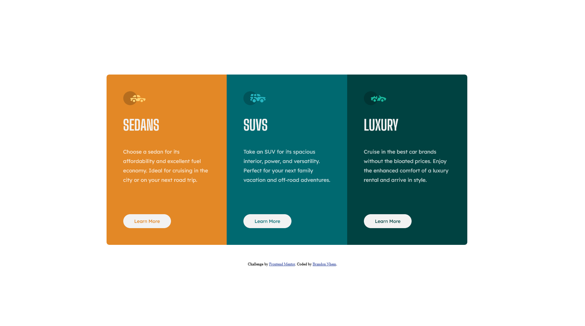
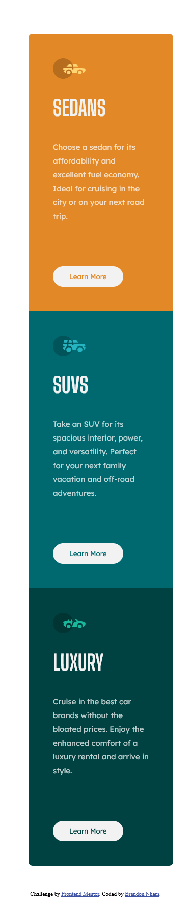

# Frontend Mentor - 3-column preview card component solution

This is a solution to the [3-column preview card component challenge on Frontend Mentor](https://www.frontendmentor.io/challenges/3column-preview-card-component-pH92eAR2-). Frontend Mentor challenges help you improve your coding skills by building realistic projects. 

## Table of contents

- [Overview](#overview)
  - [The challenge](#the-challenge)
  - [Screenshot](#screenshot)
  - [Links](#links)
- [My process](#my-process)
  - [Built with](#built-with)
  - [What I learned](#what-i-learned)
  - [Continued development](#continued-development)
  - [Useful resources](#useful-resources)
- [Author](#author)

## Overview

### The challenge

Users should be able to:

- View the optimal layout depending on their device's screen size
- See hover states for interactive elements

### Screenshot

#### Desktop View


#### Mobile view


### Links

- Solution URL: [GitHub repo](https://github.com/brandonnhem/3-column-challenge)
- Live Site URL: [GitHub pages](https://brandonnhem.github.io/3-column-challenge/)

## My process

### Built with

- Semantic HTML5 markup
- CSS custom properties

### What I learned

I was proud about creating a `row` and `column` class. It felt oddly natural to just start it off like that.

I learned about creating buttons from scratch. It took some tweaking but I was happy with the results. Of course there are many ways to create a pill-shaped button but this was my implementation.

```css
.button {
    font-family: 'Lexend Deca', sans-serif;
    line-height: 36px;
    border-radius: 48px;
    background: hsl(0, 0%, 95%);
    border: 2px solid;
    border-color: hsl(0, 0%, 95%);
    padding: 0 30px;
    cursor: pointer;
    margin-top: 40px;
}
```

I was very proud that my page was easy to modify for different viewports. On previous projects, I created pages where I had to go back and forth between modifying the desktop page after modifying the mobile page.

```css
@media screen and (max-width: 414px){
    .column {
        width: 70%;
    }

    .column-first {
        border-top-left-radius: 8px;
        border-top-right-radius: 8px;
        border-bottom-left-radius: 0;
    }

    .column-third {
        border-top-right-radius: 0;
        border-bottom-left-radius: 8px;
        border-bottom-right-radius: 8px;
    }

    .row {
        margin-top: 5%;
        margin-left: 0;
    }
}

@media screen and (min-width: 768px){
    .column {
        width: 60%;
    }

    .column-first {
        border-top-left-radius: 8px;
        border-top-right-radius: 8px;
        border-bottom-left-radius: 0;
    }

    .column-third {
        border-top-right-radius: 0;
        border-bottom-left-radius: 8px;
        border-bottom-right-radius: 8px;
    }

    .row {
        margin-top: 5%;
        margin-left: 15%;
    }
}
```

### Continued development

I would want to get more practice in aligning elements. The hardest part for me was trying to center the columns both vertically and horizontally.

### Useful resources

- [Making your page responsive](https://www.w3schools.com/html/html_responsive.asp) - I needed more info on how to adjust the page for mobile views, this greatly helped out.
- [Moving `divs`](https://stackoverflow.com/questions/15918251/how-to-move-div-vertically-down-using-css) - I used second solution to move down my `row` which I then used in centering.

## Author

- Website - [GitHub](https://github.com/brandonnhem)
- Frontend Mentor - [@brandonnhem](https://www.frontendmentor.io/profile/brandonnhem)
